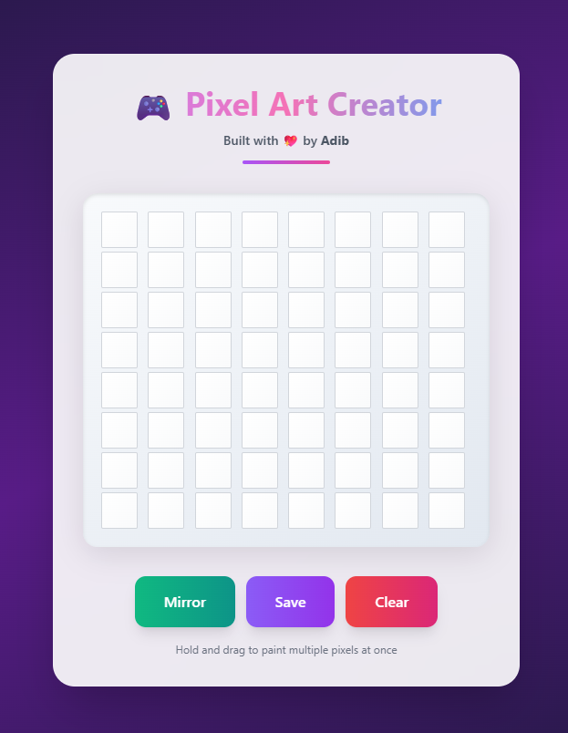

# 🎮 Pixel Art Creator

A pixel art creator designed in React and Vite and made to be fun and interactive. Start drawing and making pixel art by click and drag and rediscover your creativity. It is possible to reverse your art, clean the canvas and store what you do in the form of a PNG file.

#### Live Link: [https://pixelart.adibdev.me](https://pixelart.adibdev.me)

## Features

- **Interactive Pixel Grid:** An 8x8 grid where you can click and drag to draw.
- **Paint and Erase Modes:** Intuitively paint or erase pixels by clicking and dragging.
- **Mirror Art:** Horizontally flip your pixel art with a single click.
- **Save as PNG:** Save your creations as a PNG file with a timestamp.
- **Clear Canvas:** Start fresh with a clean canvas at any time.
- **Responsive Design:** Looks great on all devices, from mobile phones to desktops.

# Previews

<details>
<summary>Photo</summary>



</details>
<details>
<summary>Video</summary>

<p>
  <video src="https://raw.githubusercontent.com/Adib23704/Pixel-Art-Creator/refs/heads/master/public/screenshots/demo.mp4" width="450" controls></video>
</p>

</details>

## Getting Started

Follow these instructions to get a copy of the project up and running locally for development and testing purposes.

### Prerequisites

You need to have Node.js and npm (or yarn/pnpm) installed on your machine.

### Installation

1.  Clone the repo
    ```sh
    git clone https://github.com/adib23704/pixel-art-creator.git
    ```
2.  Enter the folder
    ```sh
    cd pixel-art-creator
    ```
3.  Install NPM packages
    ```sh
    npm install
    ```

### Running the Application

To run the app in development mode:

```sh
npm run dev
```

Open [http://localhost:5173](http://localhost:5173) to view it in the browser.

To create a production build:

```sh
npm run build
```

## Tech-Stack

- [React](https://reactjs.org/)
- [Vite](https://vitejs.dev/)
- [Tailwind CSS](https://tailwindcss.com/)

## License

This project is licensed under the MIT License - see the `LICENSE.md` file for details.

---

Built with ❤️ by Adib
